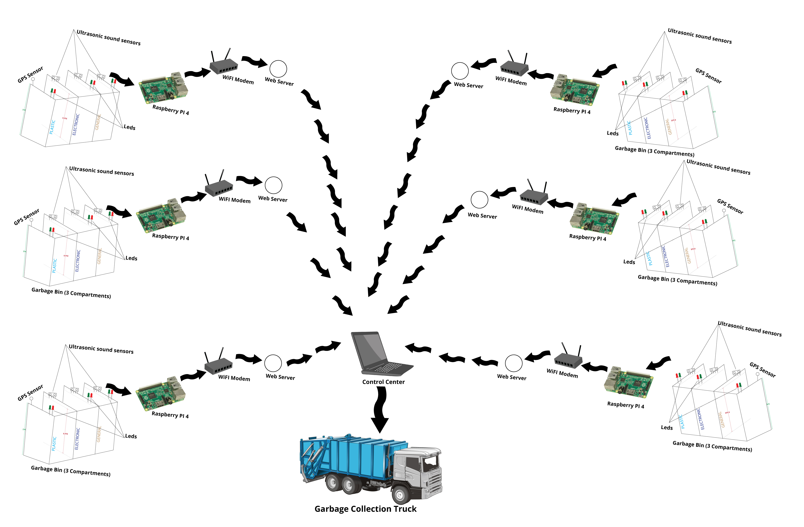
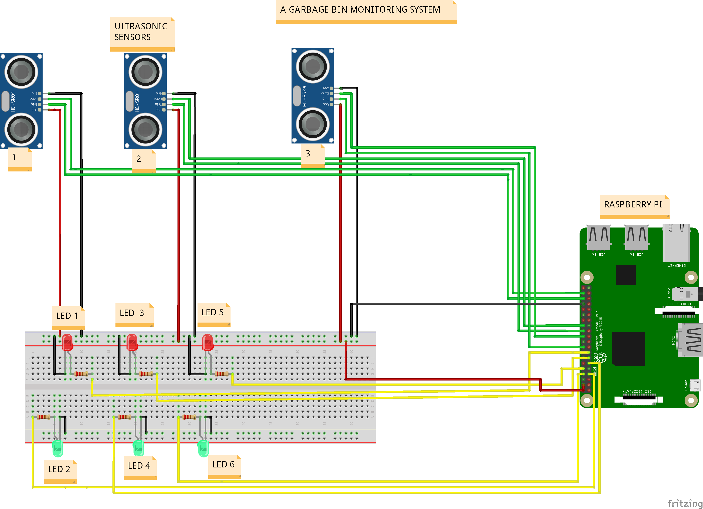
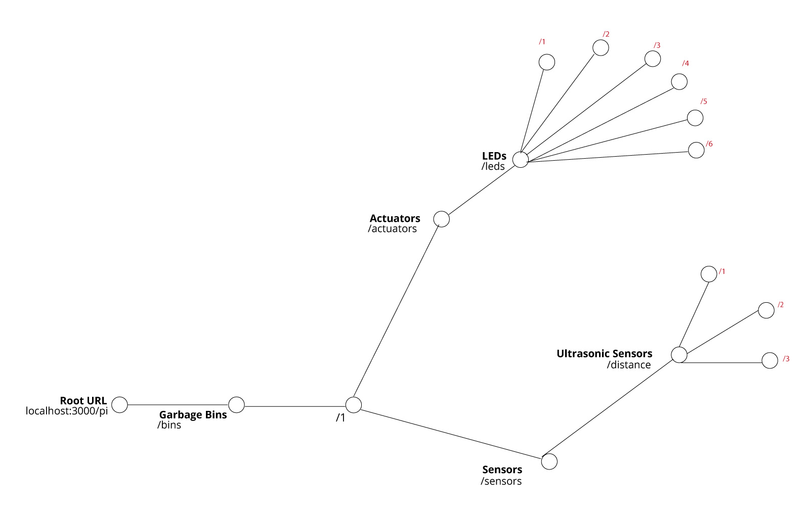
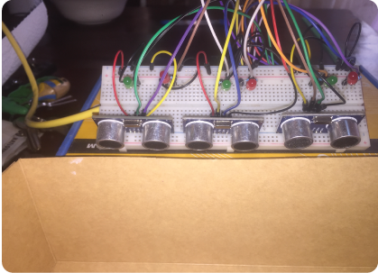

# Garbage_Bin_Monitoring_System
## A Raspberry Pi Project that Monitors the status of Garbage bins
&nbsp;
&nbsp;
### The project’s design is comprised of a Raspberry Pi 4 as the main Gateway to collate
### information from the waste bins’ 3 compartments for electronic, plastic and General
### waste.
&nbsp;
### A WiFi modem connects the gateway to the web server and all gateways send the
### information to the main control center which informs the authority agents to collect
### the garbage
&nbsp;
### Ultrasonic sensors are used to detect the garbage level and each compartment has
### a sensor attached to it.
&nbsp;
### A light system comprised of 2 LEDs is also attached to each compartment to indicate
### whether it is full or empty. The red light is turned on when the compartment
### is full while the green light is turned on to indicate that the bin compartment is
### empty.
&nbsp;
### A GPS sensor is attached to each garbage bin to track its exact location by reading
### the latitude and longitude coordinates from the GPS sensor.
&nbsp;

**Project Schenario Image Representation**

&nbsp;

**Project Fritzing Model**

&nbsp;

**Project Resource Tree**

&nbsp;

**Project Physical Wiring**

